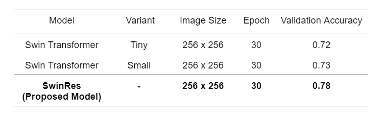

## Enhanced Diabetic Retinopathy Diagnosis with Novel Residual-based Hybrid Swin Transformer

Although swin transformer is a trending approach in computer vision, its focus on global attention can sometimes miss small local details, which has an important role in medical imaging. To overcome this problem, I proposed a residual-based hybrid swin transformer that leverages the power of the convolution network with the transformer's existing self-attention mechanism. When applied on diabetic retinopathy diagnosis task, the proposed model achieved 78.0% accuracy on the Aptos 2019 datasets with just 3662 training samples, resulting 8.3% improvement compared to the accuracy on the original swin transformer model.  


## Model Architecture

<p align="center">

Fig. Proposed SwinRes Model Architecture 
</p>  

The first phase of the base model consists of two parallel components: a tiny variant of swin transformer with 96 channels in the hidden layer of the first stage, and Resent-50 with initial 7x7 convolution layer followed by four blocks of 3x3 convolutions. The output from the transformer is passed through a linear layer, which produce a feature vector of size 150. Similarly, the Resnet output is passed through a linear layer, reducing it to the same size. These feature vectors are then concatenated to form a single output of size 300 which is forwarded to the respective batch normalization and dropout layer. In the end, there is a linear layer, which takes 300-dimensional input from the previous layer and transforms it into an output of size C, where C represents the number of target classes.


## Experiment

The proposed model was evaluated on the Aptos 2019 datasets, which consist of retinal images categorized into five classes: Normal, Mild, Moderate, Severe and Proliferative. 

<p align="center">

</p>  
<p align = "center">
Fig. Different Phase of DR Eyes
</p>

<ins>Training Specification </ins> </br>
Image size (Resized) = 256 x 256 </br>
Learning rate = 0.001</br>
Batch size = 40</br>
Epoch = 30</br>
Optimization = Adam
</pre>

When compared to the state-of-the-art Swin Transformer model, the proposed model demonstrated 8.3% higher accuracy than the existing model. 

<p align = "center">

</p>

<p align = "center">
Table: Comparision of the different models on aptos 2019 datasets 
</p>


## Visualization

<p align="center">

</p>  
<p align = "center">
Fig. Training-Validation Accuracy of SwinRes Model
</p>


## Installation and Usage
1. Clone this repository
```
git clone https://github.com/puskal-khadka/Enhanced-Diabetic-Retinopathy-Detection-with-Novel-SwinRes.git
```
2. (Optional) Create a virtual environment
```
py -m venv venv

## Activate
venv/Scripts/activate
```

3. Install the required libraries
```
pip install -r requirements.txt
```

4. Training
```
py swinres.py
```


## Reference 
- [Deep Residual Learning for Image Recognition](https://arxiv.org/pdf/1512.03385)
- [Swin Transformer: Hierarchical Vision Transformer using Shifted Windows
](https://arxiv.org/pdf/2103.14030)